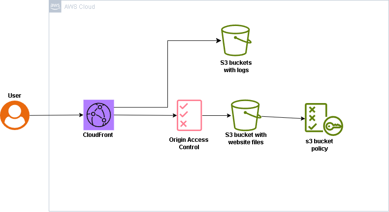
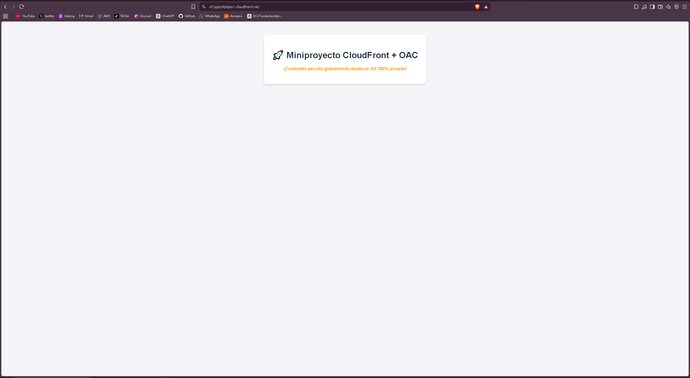

# 🔒 Secure Global Static Web Hosting with AWS CloudFront & S3 (OAC)

> **Elevator Pitch:** A high-security, low-latency static website hosting architecture. The origin storage (**Amazon S3**) remains completely isolated from the public network (`Block ALL Public Access`), routing incoming read traffic exclusively through **Amazon CloudFront** via dynamic authentication with **Origin Access Control (OAC)**.

---

##  Why This Architecture?

In corporate production environments, publicly exposed Amazon S3 buckets represent one of the primary security vulnerabilities leading to data leaks. This architecture addresses two fundamental business problems:

1. **Security & Zero Public Exposure:** Eliminates direct public S3 endpoints, protecting static assets against unauthorized access or scanning attacks.
2. **Global Performance & Availability:** Distributes content across AWS's global network of Edge Locations, significantly reducing latency for end users while minimizing origin request load.

---

## 🏗️ Architecture Diagram

---

## Key Architecture & Security Decisions

* **Perimeter Isolations** Enforced `Block ALL Public Access = True` in the S3 bucket configuration. ALL direct HTTP/HTTPS request sent directly to the s3 bucket URL are dropped at the hypervisor level.
* **Origin Access Control (OAC)** Configured a dedicated Cloudfront OAC principal that dynamically sigs every request routed to the S3 origin using AWS internal service credentials.
* **Least-Privilege Bucket Policy** The S3 Buckets restricts the `s3:GetObject` action strictly to the specific CloudFront distribution ARN using `AWS:SourceArn` conditions.

---

## Security Verification & Testting

### 1. Origin Isolation Test (Direct S3 Access)

Attemting to fetch the object directly using the S3 Object UTL returns an **HTTP 403 AccessDenied** error, confirming that origin perimeter security is active and fuctional.

! [S3 Access Denied Proof](docs/s3-access-denied.png)

### 2. Authenticated Edge Delivery (Cloudfront)

Accessing the application via the Cloudfront CDN domain successfully authenticates via OAC, serving the html content globally with minimal latency.

## Troubleshooting & Engineering Insights.

* **Default Root Object Configuration** Explicitly set `index.html` as the *Default Root Object* in Cloudfront distribution settings. Without this parameter, root domain request (`/`) result in a `403 forbidden` error because Cloudfront cannot resolve the default entry file.
* **S3 Policy Synchronization:** Validated the `AWS:SourceArn` condition within the JSON permissions document to ensure the AWS Account ID and Distribution ID matched the deployed infrastructure exactly.

--

 ## 🧹 Cost Optimization & Environment Cleanup
Adhering to cloud engineering best practices and environment hygiene, all provisioned resources (CDN distributions and test S3 buckets) were deprovisioned after completing security testing, maintaining a **$0.00** total account footprint.

